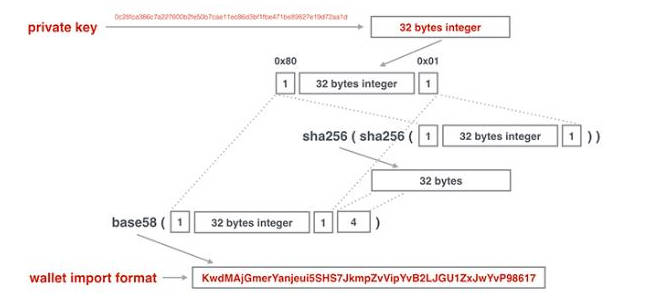
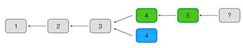

# 目录
- [比特币的简单介绍](#比特币的简单介绍)
- [数字货币VS电子货币](#数字货币VS电子货币)
- [比特币解决的问题](#比特币解决的问题)
- [P2P网络交易原理](#P2P网络交易原理)
  * [数字签名](#数字签名)
    + [公私钥](公私钥)
    + [私钥](#私钥)
    + [公钥](#公钥)
  * [交易过程](#交易过程)
- [挖矿原理](#挖矿原理)
  * [区块的头部字段](#区块的头部字段)
  * [POW机制](#POW机制)
  * [挖矿过程](#挖矿过程)
  * [共识算法](#共识算法)
- [可编程支付原理](#可编程支付原理)
  * [P2PKH脚本](#P2PKH脚本)
  * [多重签名](#多重签名)
# 比特币的简单介绍
**比特币是人类历史上第一种数字货币**！

**什么是数字货币？数字货币就是基于数学加密原理构建的不可伪造的货币系统，而比特币是一个基于数据加密原理构建的分布式的数字货币系统**！

**比特币与区块链的关系是什么？一句话概括：比特币使用了区块链技术实现了数字货币的可信支付**！

比特币是2008年10月中本聪在密码学朋克论坛上发表的一篇文章：[比特币：一种点对点的电子现金系统](https://bitcoin.org/bitcoin.pdf)，这个可以看成是比特币的白皮书；随后在2008年11月，中本聪发布了比特币的第一版代码。
2009年1月，中本聪挖出了比特币的第一个区块——创世区块，标志着比特币网络的正式运行。


# 数字货币VS电子货币
其实无论是现金支付还是电子货币支付，交易的过程都需要通过银行这个媒介进行，现金的通过银行则是通过税法来体现，电子货币的交易的通过银行则是第三方机构与银行签订的合约进行！只有通过银行了，国家财政才能知道近年来的货币流转程度，才能知道最近国家的经济情况，从而根据这种情况去印刷新版货币来流入市场，保证经济，防止经济膨胀和经济紧缩。所以，无论任何交易都要通过银行这个机构来进行。

那么数字货币则是不需要一个类似银行的中央信任机构，就可以通过全网的P2P网络进行发行和流通，这听上去不可思议。

# 比特币解决的问题
比特币就是通过技术手段解决了现金电子化后交易的清结算问题！清结算的官方定义是：**对交易数据依据机构和交易类型进行分类汇总，并计算结算金额的过程**。

传统的基于银行机构进行交易，本质上都是通过中央数据库，确保两个交易用户余额的以增一减，这个交易高度依赖开发和运维人员，以及完善的风控机制。

比特币则是通过区块链技术，把整个账本全部公开，人手一份，全网相同，因为，如果个人修改账本，是不会被其他人承认的。

比如：我们现在有一个交易发生，交易金额是M0，并且是A向B出售货物，B向A付款M0，如果通过电子货币进行交易，是不是可以理解为以下流程。B手上目前有银行的M0的负债，也就是B有M0个资产，那么进行交易后，也就是B的资产减少M0，A的资产增加M0，银行向B的负债，现在转化为银行向A的负债。对银行来说整个负债是平衡的。那么如果通过现金，是不是就不用通过银行这个机构进行交易，就不会产生资产与负债的关系。所以通过电子货币，无论怎样都绕不开中央信任机构的问题，因为用户需要信任银行不会篡改余额！

比特币就是可以理解为电子上的现金支付，也就是点对点的支付系统！

# P2P交易原理
比特币既然可以理解为基于电子的现金交易，那么是怎么实现的？是通过一种P2P的交易形式：假如A和B想电子的现金交易的方式进行交易，那么一种创建交易的方式是，A声称自己有1万元，这显然是不可信的；那么如果A对自己的话能够做一个验证，确实有1万元，那么是否可以认定A是可以进行交易；但是这个可信度还是不够，如果能够保证A有这1万元，并且一定会想去交易即可，是不是就可以保证交易是肯定发生的？所以，这个方法就是P2P交易。

确保A有1万元，是交易网络进行判断的，而确保A一定想发生交易，是通过数字签名进行的。

## 数字签名
这个概念就类似于签合同，如果继续上面的例子，如果A想要进行交易，就需要先做一个声明，并且在整个声明上签字，A签字的含义就是：A证明自己拥有1万元，并且保证自己是希望进行交易的。所以数字签名就保证了交易的有效性！！这个签名是通过数据签名算法（公私钥）进行的，比验证笔记更加可行！

### 公私钥
在数字签名的过程中，每个人都可以自己生成一个密钥对，这个密钥对是包含一个私钥和一个公钥，私钥是自己严格保密的，公钥是可以公开给别人的。在比特币中，公钥是可以公开发布给全网的！

整个签名的过程大致是这样：A对想要进行1万元交易这个消息进行签名的时候，可以用自己的私钥进行签名，然后把这个消息和公钥发布出去，网络上任何人都可以收到这个消息和公钥，而别人想要确认这个消息，就只需要拿公钥去验证，如果验证通过了， 那么就可以完全肯定这个消息是A发出去的。

**而这个公私钥的生成过程也是通过上一个文章所说的Hash进行处理的**。

**一般常用的数字签名的算法有三种：RSA算法、DSA算法和MCDSA算法，比特币采用的签名算法是椭圆曲线签名算法，ECDSA算法，使用的是定义好的标准曲线secp256k1函数**，公式是`y^2 = x^3 + 7` 。

**ECDSA算法需要的是一个私钥来生成一个公钥，并且由私钥是很难推算出公钥的，所以不需要保存公钥**。私钥本质上就是一个1～2^256的随机数， **而比特币的私钥确切的说是比2^256次方要小一点，而比特币的公钥是通过私钥生成的两个256位的整数**！！所以**用户只要提供一个256位的整数组成私钥即可，但是这个私钥最好是通过使用编程语言提供的安全随机数算法来生成**！因为，比特币规定，不可以修改公私钥，并且如果别人获取了你的私钥，那么你无法改动你的账户，他也能轻松获取该账户下的比特币！这里，公钥更像是你的银行卡卡号，私钥则是银行卡密码。

**并且全网所有用户都可以通过公钥来查看你账户中的余额**。

但是实际上，你的公钥上传到网络中，并不是你真实的公钥内容，而是经过处理后的内容传输到网络中，那么公钥这么做了，私钥其实也会经过处理，因为256位整数会非常大，经过处理通过hash来判别私钥是否出问题。这个处理过程有两种：一种是压缩；一种是非压缩。压缩对应的就是压缩私钥和压缩公钥，非压缩也是类似（非压缩已经不常用了）。接下来我们具体的了解一下这个过程！

### 私钥
首先，我们已经知道了私钥是256位二进制整数组成的，但是想要记住这个私钥是非常难得，而且你即使输错了某些位，那么该私钥依旧是一个有效的私钥，判断不了你输入的私钥是否正确，所以比特币有一种对私钥进行编码的方法，既能判断私钥是否成立，又能对私钥进行加密，那么这种编码方法就是Base58。

在了解之前需要知道几个概念：1、**对私钥进行 Base58 编码有两种方式，一种是非压缩的私钥格式，一种是压缩的私钥格式**，非压缩格式现在基本不用了！2、**私钥经过Base58编码处理完成之后的私钥地址，被称为WIF**(Wallet Import Format 钱包导入格式)。

非压缩的WIF过程如下图：


过程描述如下：第一步，通过计算机随机数编码，获得了一个随机的256位二进制整数的私钥，也就是32字节的私钥，这里记私钥为key；第二步：**之后在这个私钥的开头添上一字节 —— `0x80` 做为前缀**，这里记 0x80+私钥 为A；第三步：这里对**A进行dhash**（两次sha256）的hash计算；第四步，**把这个dhash计算的结果的前4字节内容获取过来，加在A的末端**，这样，整体就是32+1+4=37字节的长度；第五步：之后对这串内容进行Base58计算。这样就得到了WIF的私钥地址，**这个非压缩格式的WIF总是以5开头**。

压缩的WIF过程如下：



压缩的WIF的生成过程步骤完全等同于非压缩的WIF的生成过程，唯一不同的则是内容上的不容，发生在第二步，**压缩格式的WIF不仅需要添加上 `0x80`的后缀，还需要添加 `0x01`的后缀**，之后这一个整体打包进行第三步的dhash计算。其他过程都等同于非压缩格式，这里不做过多赘述，看图即可理解！**这里也有个规律，压缩格式的WIF总是以K或者是L作为开头**！**记住都是大写的**！

**疑问1**：为什么需要在尾部加上4字节才能在计算Base58呢？
<br>**答**：这是因为这4字节在这个内容中起到了校验位的作用！而加上前缀或者加上后缀都可以理解为是比特币的协议规定的！

**疑问2**：如果按照上面所说的，为什么密钥的压缩格式的WIF表示要比非压缩格式的WIF还要长一位？
<br>**答**：确实是长一位，但是密钥的压缩与非压缩WIF格式对应的是公钥的压缩和非压缩格式。**第一：在比特币的网络中，并不允许公钥直接的传输在网络中，而是需要通过编码才能在网络中传输，这个私钥经过编码转化后的内容，我们称之为：地址。第二：我们通过ECDSA算法中的secp256k1函数得知，私钥作为输入，则会有两个32字节长度的整数输出，这两个都是公钥，这里记作`(x, y)`；如果私钥用非压缩的WIF编码进行处理，那么公钥也需要转化成非压缩格式的地址，这个非压缩格式的公钥是需要`x`和`y`两个公钥拼在一起，在经过一定处理才能得出地址；但，如果私钥用的是压缩格式的，那么地址和公钥也是需要压缩格式转化的，这个公钥的表示就只需要`x`和`y`中任意一个公钥作为内容即可，然后再经过转化就可变成地址了**！这个转化的过程我在公钥，也就是下面的小章节中介绍，现在我放出私钥，公钥，地址三者之间的关系。记住，**因为hash函数的单向性，所以，无论如何，地址是反推不出公钥，公钥反推不出私钥的**！


### 公钥
通过上面的第二个问题，我们可以得出，公钥是通过私钥经过ECDSA算法中的ECC曲线（secp256k1曲线）得出的两个结果，并且两个结果都是公钥。**根据ECC曲线的特点，一个公钥x可以推出另一个公钥y，但是需要提前知道y的奇偶性**；那么我们也**可以通过非压缩格式的公钥推测出压缩格式的公钥**。原因如下：**压缩格式的公钥实际上只保留了`x`这一个256位整数，但是需要根据 `y` 的奇偶性在 `x` 的前面添加 `02` 或者 `03` 作为前缀。`y` 为偶数时添加 `02`，为奇数时添加 `03`。**

综上可以得出，**非压缩格式的公钥其实是两个256位（32字节）的整数拼在一起的结果，整体是64字节，压缩格式的公钥其实是一个256位（32字节）的整数加上一个1字节的奇偶判断位，整体是33字节**。由此可以得出，无论是私钥的压缩非压缩还是公钥的压缩非压缩，都是因为公私钥的对应关系以及公钥的这个特性得出的！

了解了以上这么多，我们再来了解一下公钥转化成地址的做法。这里拿压缩格式公钥为例：先看图了解大概


**第一步：压缩格式公钥是33字节长度；第二步：对这个压缩格式公钥进行hash160编码方法进行计算（先经过依次hash256，在经过依次RipeMD160）得到20字节长度的一个Hash值；第三步，按照比特币的规范要求，在这个20字节长度的Hash前添加上`0x00`前缀；第四步：对这个21字节长度的数据经过dhash计算，并取出前4字节作为校验位；第五步：把这四字节的校验位拼接到第三步结果的21字节长度的数据上，最后就得到了总长度位25位的一个hash数据；第六步：对这25位字节长度的数据经过Base28编码，就可以得到一个总是以`1`开头的一个比特币地址了**。这个地址是可以发送公布到全网范围的！

**注意：**
<br>1、**这个地址无论是针对压缩格式的公钥还是非压缩格式的公钥，计算结果都是以1开头的地址**！
<br>2、因为经过了Hash计算，所以光从地址的角度想逆推看出公钥是压缩还是非压缩的，这个是无法区分的！
<br>3、仅仅提供地址是不能让其他人得知公钥的。一般来说公开公钥是没有安全风险，并且实际上，如果某个地址上有对应的资金，要花费该资金，就需要提供公钥。如果某个地址的自己被华为过至少依次，那么该地址的公钥实际上就是公开的了！
<br>4、**这个地址才是在交易过程中比特币一条交易记录中所记载的地址，交易记录中记载的并不是公钥**！


## 交易过程
在比特币中，在区块链上的每个区块，都至少包含一笔交易，并且每个区块的第一个交易通常是CoinBase交易，也就是矿工挖矿的奖励，后续的交易内容才是用户之间的交易。
<br>我们再来看记录在区块链上的交易。每个区块都记录了至少一笔交易，一笔交易就是把一定金额的比特币从一个输入转移到一个输出：
<br>注：这个就可以看作区块链的一部分，新的区块是加在链表的尾部，也就是右边！


例如，小明把两个比特币转移给小红，这笔交易的输入是小明，输出就是小红。实际记录的是双方的公钥地址。

如果小明有50个比特币，他要转给小红两个比特币，那么剩下的48个比特币应该记录在哪？比特币协议规定一个输出必须一次性花完，所以，小明给小红的两个比特币的交易必须表示成：


小明给小红2个比特币，同时小明又给自己48个比特币，这48个比特币就是找零。所以，一个交易中，一个输入可以对应多个输出。

当小红有两笔收入时，一笔2.0，一笔1.5，她想给小白转3.5比特币时，就不能单用一笔输出，她必须把两笔钱合起来再花掉，这种情况就是一个交易对应多个输入和1个输出：


如果存在找零，这笔交易就既包含多个输入也包含多个输出：


在实际的交易中，输入比输出要稍微大一点点，这个差额就是隐含的交易费用，交易费用会算入当前区块的矿工收入中作为矿工奖励的一部分：


当我们要简单验证某个交易的时候，例如，对于交易`f36abd`，它记录的输入是`3f96ab`，索引号是`1`（索引号从`0`开始，`0`表示第一个输出，`1`表示第二个输出，以此类推），我们就根据`3f96ab`找到前面已发生的交易，再根据索引号找到对应的输出是0.5个比特币，所以，这笔交易的输入总计是0.5个比特币，输出分别是0.4个比特币和0.09个比特币，隐含的交易费用是0.01个比特币：


以上就是交易的全流程！

# 挖矿原理
挖矿并不是真的挖矿，哈哈哈哈！这个冷笑话可能一点不好笑~。其实在P2P网络中，总有一类节点在不停的去进行计算，目的是把新的交易打包成新的区块并附加到区块链上。又因为区块链的交易部分第一条交易就是矿工的挖矿奖励，意思就是每产出一个新的区块，创建该区块的矿工会分的奖励。这个过程类似挖矿，故其名为矿工。

在了解挖矿的过程之前，我们需要先了解几个部分的知识：区块链中每个区块的头部字段包含哪些，以及区块链中最重要POW（工作量证明）。

## 区块的头部字段
区块链的每个区块可以理解包含两大信息：**区块的头部信息以及整个交易的主体信息**。

区块的整个交易信息包含的该区块的每个交易内容，并且**第一条交易信息通常都是CoinBase**（矿工挖矿的奖励）！

区块的头部信息包含6个字段：Version（版本），Previous Block Hash（前向区块的区块Hash）、Merkle Root（交易的部分的Hash）、TimeStamp（时间）、Bits（难度目标）、Nonce（随机数）。这6个字段一定要知道他们的用处，以及长度！接下来分别详细介绍一下这6个字段的信息

**Version**：长度为**4字节**，主要是随着比特币协议的升级而改变。该字段并不是很重要！
<br>**Previous Block Hash**：长度为**32字节**，存储**前向区块的Hash**，在挖矿的过程中，该信息会预先得到！
<br>**Merkle Root**：长度为**32字节**，存储当前区块的**所有交易的数据的dhash值**！
<br>**Timestamp**：长度为**4字节**，用于记录区块生成的时间；
<br>**Bits**：长度为**4字节**，用于**记录当前区块的挖矿难度目标**，主要是**用于调整POW算法的难度**，以维持平均每10分钟生成一个新区块的时间；
<br>**Nonce**：长度为**4字节**，用于**在POW过程中被不断的调整的**，主要用于在挖矿过程中一直去调整这个值，来找到一个满足难度的区块头hash值。

## POW机制
其实在讲解之前，我们举一个小例子。
<br>题目是：如何证明一个班级里面哪一位同学的数学能力最强？
<br>目前有一个思路是这样：由老师出题，题目是进行解比如是`x^5`次方的高次方程，那么如果谁能最快接出这道题目，那么是不是谁的数学能力最强。答案是肯定的。
<br>**问题一**：但是如果全班所有人题目是一样的，那么避免不了互相抄袭的嫌疑，那么根据数学公式的特性，多项式的难度是根据自变量的最高次方决定，并不由其他因素决定，所以，老师做了如下决定：全班所有人题目都不同，但是只保留方程的自变量的最高次幂不变，出不同的多项式，那么就可以解决互相抄袭的嫌疑。
<br>那还有个问题，**问题二**：因为不是正规的高考，只是一个测试，所以每个同学都是拿草稿纸写的，那么每个同学都没写名字，该怎么判断是谁解的呢？我们给每个同学编号，1,2,3...把这个同学的编号作为老师给这个同学题目的最高次幂的系数，这样，老师只需看出交上来的草稿纸的多项式最高次幂的系数，是不是就可以判断是哪个同学解出来的呢？
<br>还有一个问题，**问题三**：因为老师给全班不同的同学提出的问题是不同的，那么她需要提前去解这个方程，那岂不是很麻烦？答案是不需要，因为同学交上来的答案是不是这个方程或者是多项式的解，那么是不是可以直接把这个解带入多项式，如果验证是正确的，那么是不是就可以判断，这个同学做的题目是正确的？
<br>最后还有一个问题，**问题四**：多项式，那么肯定是多个解啊，验证是正确的，但是答案可能并不完全啊，那怎么能做解呢？这个问题是合理的，但是在比特币挖矿过程中，通过修改nonce字段计算dhash，这个结果如果满足的值是符合条件的，那么它就是解出的答案，这个答案是算作区块的区块hash，因为区块hash具有唯一性，所以只需要一个即可，故在实际中并不需要多解，所以只需要去验证答案即可，并不需要去解出答案的全集！

通过上面的例子，你可以了解到，POW（Proof Of Work）中的证明就是你的结果能够验证出来确实是答案，因为不存在窃取别人的工作量证明的结果（抄袭别人的答案），所以如果验证通过，那么你的答案那么就是正确答案！当然，这种方程式的解法问题对计算机来说太过简单，所以肯定不是让你求方程的解。那么现实的工作量算法，就是让计算机无法快速解算出来，这种算法就是Hash算法！

## 挖矿过程
通过了解区块的头部字段以及大致了解POW的机制，那么我们还需要了解一些具体的信息，比如POW采用的算法，之后才能去了解挖矿的过程！

首先需要了解挖矿的目标：挖矿的意思就是创建一个新的区块，连接在原来的区块链的末端！

那么**怎么才能去创建一个新的区块**呢？**这里就有一个定义：比特币协议规定，如果你计算出了一定要求的Hash值，来表示当前区块的区块Hash，并且这个Hash能够通过P2P网络中其他矿工的验证，那么你的区块就是有效的，即挖矿成功**！

这里的**要求计算的Hash结果是这么定义**的：对于32字节长度的Hash值，也就是有**64位16进制**，**比特币协议会根据当前网络中的全网算力的大小进行计算，估算出一个难度值，如果你计算的Hash值低于这个难度值，那么你的区块Hash计算则为成功**，可以全网公布！怎样进行估算全网算力，并估算难度值，为什么是计算的Hash低于这个难度值才算成功，下文会慢慢介绍！

首先了解一点：**hash的输入与输出都是随机性的**；其次，如果想要输出的首位是0的Hash值，是不是大约需要计算16次；如果想要输出端部两位是0的Hash值，是不是大约需要计算`16^2=256`次，那么依次往后，如果想要计算端部连续17位都是0的Hash值，是不是需要`16^17`次方，相当于需要计算2.9万亿亿次才可能得到结果，这对于计算机来说并不是可以在非常短的时间内能够解出来的！所以比特币的工作证明算法就是采用这种方法进行处理的！

了解了比特别协议采用的工作证明算法，那么我们了解一下，**比特币是通过什么方法来通过当前的全网算力来设置难度值的**？
<br>比特币协议中通过**设置一个difficulty**来控制区块生成得速度，**实际目标难度是根据区块头部的 `Bits字段` 计算出来的**，我们这里详细介绍一下，**如何把`Bits字段`转化为难度目标的，并且它的转化公式是什么样的**？

**如何把`Bits字段`转化为难度difficulty？**
<br>**转化过程是：Bits通过公式计算出难度目标，之后难度目标在通过一个公式转化为难度(dificulty)**。通过上面的学习知道头部的Bits字段长度是4字节，是32位二进制长度，**它的格式如下：高8位表示指数，低24位表示系数。Bits转化为难度目标的公式是：$`难度目标 = 指数 * 256^(系数-3)`$**，这里记作公式A。这个是Bits转化为难度目标的公式，那么**从难度目标转化为难度的转化公式是：$`difficulty=\frac{max_target}{难度目标}`$**，这里记作公式B。

首先，我们就公式A来说，其实难度目标是一个整数，表示表示一个难度目标，**它的大小是受到网络中总算力大小的影响，如果它越高，那么难度目标越高**。
<br>之后我们在来谈论公式B，分子max_target，表示的是当**难度是1的目标阈值，这是一个固定值**，`max_target=0x00000000FFFF0000000000000000000000000000000000000000000000000000`，这是一个难度为1时的整数。分母则是刚刚算出的难度目标。

**接下来分析这三者之间的关系**
<br>**如果现在全网算力提高，那么我们Bits会因此受到影响，Bits的值就会提高，那么我们的难度目标的值也就提高，从而对计算难度时的分母提高。分母提高，分子不变，那么难度值就会减少。难度值减少，是不是表示的整数就越小。difficulty并不是存储在区块头部，区块头部只是保存Bits，difficulty是通过这两步计算得出的256位二进制，所以difficulty是一个整数。那么我们继续分析，难度值减少，也就是difficulty也就越小，是不是用它表示的64位十六进制的hash值也就是端部的0越多。又因为经过之前的介绍，端部的连续的0越多，计算机需要计算的难度会成指数增长，每多出一个零，计算难度提升16倍。所以上文中说过，如果你改变区块头部的nonce的值，然后通过dhash的计算找到了某个hash值是低于难度值时，那么这个区块hash就是有效的。**

**在讲解挖矿过程之前的预备内容都已讲透，那么接下来讲解具体的挖矿流程：
<br>我们想要计算一个区块的Hash，那么需要把这个区块整体的内容作为Hash的输入（数据结构是json格式的），输出的就是一个32字节长度的Hash值。这里提到了把区块整体作为Hash输入：所以这个输入内容是包括该区块的头部信息以及主体的交易信息。
<br>我们拆开两个部分看，首先关注 —— 区块的交易信息部分：交易信息是包括两部分：矿工的挖矿交易，以及P2P网络中目前的交易信息；后者的内容可以看作是每个矿工获得的都是一样的。唯一不同的是矿工的挖矿交易部分，因为矿工的地址（上文提到的比特币的交易地址，并不是公钥，这里回顾一下概念）不同，所以这条内容固然不同，故区块头部的Merkle字段的Hash值也不同。
<br>主体部分分析完成，我们再来关注一下区块的头部部分：总共六个字段，其中就两个Prev hash和版本是每个矿工固定的；其他的都是不同的。Merkle Hash，因为每个矿工第一条交易不同，所以不同。timestape，这个时间戳精确到秒，每个矿工可能都不同。难度目标，里面的值的端头的0肯定是一样的（类似前面小例子中的自变量的最高位表示难度，系数代表不同的人），但是后面内容也是每个矿工不一样的。随机数，更不用说，因为计算机就是调节这个值来计算的Hash，所以每个矿工更是不同。所以这就保证了工作量算法的安全性与稳定性，保证了网络中互相得不到答案，并且也能保证一定的难度，且通过Bits字段能够将区块的生成时间稳定在10分钟一个。
<br>针对每个矿工来说，区块的交易的主体部分肯定是一直不变的，区块的头部部分也只会改变nonce的值，就是通过改变nonce的值，之后，把头部部分做成一个json，将其作为dhash的输入，直到算出的hash的值是小于难度值，那么，这个矿工就相当于计算出了这个区块的区块Hash。但是这并不代表创建区块是成功的。因为还需要把结果发布到网络中，P2P网络周围的矿工会验证结果，如果周围的矿工验证成功，那么才相当于你创建区块成功！
<br>你把结果发送到P2P网络中，并不需要担心别人会嵌套你的结果，因为Merkel Hash只是一个Hash值，并不能推算出交易的数据，并且每个矿工在挖矿时产生的区块数据是不同的，所以不会被别人窃取！**

以上就是挖矿的全流程！

比特币网络的难度是不断变化的，它的难度保证大约每10分钟产生一个区块，而难度值在每2015个区块调整一次：如果区块平均生成时间小于10分钟，说明全网算力增加，难度也会增加，如果区块平均生成时间大于10分钟，说明全网算力减少，难度也会减少。因此，难度随着全网算力的增减会动态调整。

**POW（工作量证明机制）保证了修改区块链需要的成本极高，所以导致了区块链的不可篡改的特性得到了保护**！

### 共识算法
现在假如遇到这样一个问题：**如果两个矿工在同一时间各自找到了有效区块。这个时候，网络上的其他矿工应该接受哪个区块添加到区块链的末尾呢**？
<br>首先需要明确一个点：**因为每个矿工的CoinBase是不同的，所以Merkle Hash是不同的，所以区块Hash也是不同的，只是他们都满足了Bits计算出的difficulty的要求，所以都可以算作是有效的**！

答案是都**一起接收**！理由如下：由于P2P网络的广播顺序不确定性，不同矿工收到的区块是有可能不同的，那么这个时候区块就会发生分叉，不同的矿工会在两个分叉后面继续挖矿，但是**无论怎么样，总会有一个分叉点最先挖出后续的矿**。这个时候，由于比特币网络采取的是**最长分叉共识算法**，也就是**比特币网络只认同区块链中最长的链表**，所以**整个网路中的所有矿工都会继续在最长的链上继续挖矿！那个分叉的一路则被作废**！



由于区块链虽然最终会保持数据一致，但是，一个交易可能被打包到一个后续被孤立的区块中。所以，要确认一个交易被永久记录到区块链中，需要对交易进行确认。**如果后续的区块被追加到区块链上，实际上就会对原有的交易进行确认**，因为链越长，修改的难度越大。一般来说，**经过6个区块确认的交易几乎是不可能被修改**的。

# 可编程支付原理
在学这个知识点之前，我们需要先了解一个东西，**其实个人持有的比特币是流通在网络中的，你拥有比特币，其实可以理解为你只是拥有这个比特币的使用权。并且，比特币的交易可以理解使用权转化的过程，而想要做到这个过程，需要的是一对脚本的使用。** 是的，你没有听错，是一对脚本的使用。

比特币的所有交易都会被记录在比特币区块链中，任何人都可以通过公钥查询到某个交易的输入和输出。**某人如果想要花费这个输出，那么他实际做的操作就是把自己公钥下某个或多个交易的输出支付给别人**。他需要把这笔交易通过私钥进行签名，然后提交给矿工进行验证，如果验证通过，那么矿工就会打包这个交易到区块中，那么交易就会被确认！**重点来了：其实，交易被确认，并不代表比特币是直接从你钱包里移交给别人，而是你提交一个“锁定脚本”，这个时候就表示了这个人已经有了这一笔比特币了。如果那个人想要花费这一笔比特币，那么他需要提交一个“解锁脚本”，去解锁他接收到的这笔比特币，之后再提交一个锁定脚本，那么这个时候就相当于这个人把这笔比特币花出去了。这个时候就相当于他花费了这笔比特币。这也就是为什么称比特币是可编程支付的**。可以这么理解，**解锁脚本相当于你想要去使用了这笔比特币，锁定脚本相当于你拥有了这笔比特币！所以你总是会先有个锁定脚本，才会有解锁脚本。**

> 举个例子，小明小红小张三人进行交易，交易的顺序是小明付给小红1BTC，小红再付给小张1BTC。首先，小明通过别人提供的锁定脚本，获得了1BTC，那么他现在需要把这个1BTC交易给小红，那么他需要先提供一个解锁脚本，去解锁小明之前收到的锁定脚本，如果解锁成功，那么他需要提供一个锁定脚本，去把1BTC交易给小红。这个时候小红相当于已经有了1BTC，小明就没了这1BTC的使用权了。小红到下一交易期间都拥有这1BTC的使用权，但并不是进入了他的钱包（实际就是你的钱，进入你钱包，但是这么说好理解）。小红遇到了需要交易的小张，那么小红需要提交一个解锁脚本，解锁成功，在提交一个锁定脚本，就表示了小张有了这1BTC。过程可以看下图


**所以，比特币交易的输出是一个锁定脚本，而下一个交易的输入是一个解锁脚本**。

## P2PKH脚本
以一个真实的比特币交易为例，某个比特币的某个输出脚本是`76a914dc5...c88ac`二进制的十六进制表示数据，这个输出脚本可以理解成锁定脚本。这个例子中的输入脚本是`483045022...cf740f`，也是二进制的十六进制表示数据。


针对P2PKH标准脚本来说，我们先来看锁定脚本：`76a914dc5dc65c7e6cc3c404c6dd79d83b22b2fe9f489c88ac`

**首先它的锁定脚本结构是：2个操作码 + 一个表示长度码 + 一个对应长度数据 + 2个操作码**。针对这个例子中的锁定脚本，其中`76`对应操作码是`OP_DUP`，`a9`对应操作码是`OP_HASH160`，`14`表示接下来的数据长度是20字节（16进制的14转化为10进制的数是20），之后就是一个20长度的16进制数，在之后的`88`表示操作码`OP_EUQALVERIFY`，最后的`ac`表示操作码`OP_CHECKSIG`。所以整个锁定脚本就是：
```
        OP_DUP 76
    OP_HASH160 a9
          DATA 14 (dc5dc65c...fe9f489c)
OP_EQUALVERIFY 88
   OP_CHECKSIG ac
```

**再来看一下解锁脚本：它的结构就很简单，一个长度码 + 一个长度数据 + 一个长度码 +  一个长度数据**。针对这个例子中的解锁脚本，其中`48`表示接下来是一个72字节长度的数据，这个数据是用户的签名数据，`21`表示一个33字节长度的数据这个数据是用户的公钥数据。

如果小明想要已经获得了小红的1BTC的锁定脚本，那么怎样她才能进行下一笔交易？小红会拿自己的解锁脚本与小明传来的锁定脚本进行拼接！
```
          DATA 48 (30450221...68fa9b01)
          DATA 21 (03dd8763...14cf740f)
        OP_DUP 76
    OP_HASH160 a9
          DATA 14 (dc5dc65c...fe9f489c)
OP_EQUALVERIFY 88
   OP_CHECKSIG ac
```
**比特币脚本是一种基于栈结构的编程语言**，所以准备一个空栈，首先执行`DATA 48`，压缩数据`30450221...68fa9b01`。之后再执行`DATA 21`，压缩数据`03dd8763...14cf740f`。之后再执行`OP_DUP 76`，表示会把栈顶的元素复制一份；再之后执行`OP_HASH160 a9`计算，表示会把栈顶的元素进行一个SHA256和RipeMD160两次计算，然后把这个结果替换成栈顶元素。之后再执行`DATA 14`，表示把这个数`dc5dc65c...fe9f489c`入栈，之后执行`OP_EQUALVERIFY`进行对栈顶的两个元素进行判断是否相同，如果相同再继续后续代码`OP_CHECKSIG`，把最后栈顶的两个元素，第一个看成公钥，第二个看成签名，判断签名的有效性，如果有效，则结果返回1入栈，否，则返回0入栈。当最后整个脚本运行结束，会判断最后再栈中的是1还是0，来作为这个交易的有效性。
<br>整体的过程可以在下图中查看：


通过P2PKH的标准脚本可以看出，这个交易过程类似于解谜过程，如果谁能解出对应的谜底，那么这个人就能获得一笔比特币。而且，冲这个过程中可以看出，这个交易的验证过程并不包含负责的循环或者判断语句，所以这种验证的过程只涉及到简单的签名验签的简单过程。并且这个过程是可以进行计算机处理的，**是个程序，所以我们可以根据自己的需要来进行验证操作。比如我们可以进行多重签名，也就是让一笔交易只有在多个人同意的情况下才能够进行**。最常见的多重签名脚本可以提供3个签名，只要任意两个签名被验证成功，这笔交易就可以成功。
```
FROM: UTXO Hash#index
AMOUNT: 10.5 btc
TO: P2SH: OP_2 pk1 pk2 pk3 OP_3 OP_CHECKMULTISIG
```
这种方式也可以一定程度上防止丢失私钥的风险。3个人中如果只有一个人丢失了私钥，仍然可以保证这笔输出是可以被花费的。

**从中可以看出支付的本质**：**比特币支付的本质是由程序触发的数字资产转移。这种支付方式无需信任中介的参与，可以在零信任的基础上完成数字资产的交易，这也是为什么数字货币又被称为可编程的货币。由此催生出了智能合约：当一个预先编好的条件被触发时，智能合约可以自动执行相应的程序，自动完成数字资产的转移。保险、贷款等金融活动在将来都可以以智能合约的形式执行。智能合约以程序来替代传统的纸质文件条款，并由计算机强制执行，将具有更低的信任成本和运营成本。**

## 多重签名
上一节我们也说了，多重签名的问题。它即保证你私钥即使丢失，但是能最小化你的损失，而且也能分散风险！！具体的实现如下：

如果有N个人分别持有N个私钥，那么只要其中M个人同意签名就可以动用这个“联合地址”的资金。多重签名地址实际上是一个`Script Hash`。根据之前的脚本编码，这里的多重签名其实就是一个P2SH脚本，解锁脚本就是需要M个签名+Redeem Script

**注意：从多重签名的地址本身并无法得知该多重签名使用的公钥，以及M-N的具体数值。必须将Redeem Script公示给每个私钥持有人，才能够验证多重签名地址是否正确（即包含了所有人的公钥，以及正确的M-N数值）。要花费多重签名地址的资金，除了M个私钥签名外，必须要有Redeem Script（可由所有人的公钥构造）。只有签名，没有Redeem Script是不能构造出解锁脚本来花费资金的。因此，保存多重签名地址的钱包必须同时保存Redeem Script。** 多重签名降低了单个私钥丢失的风险。

在现实中，一个提供在线钱包服务，为了保障用户的资金，使用2-3类型多重签名，即服务商有1个私钥，用户持有两个私钥，一个作为常规使用，一个是作为应急使用。在正常情况下，用户只需要使用常规私钥配合服务商完成正常交易即可，当非正常情况，用户可以使用自己两个私钥完成资产的转移。

**比特币的多重签名最多允许15个私钥参与签名，即可实现1-2至15-15的任意组合（1⩽M⩽N⩽15）**。
